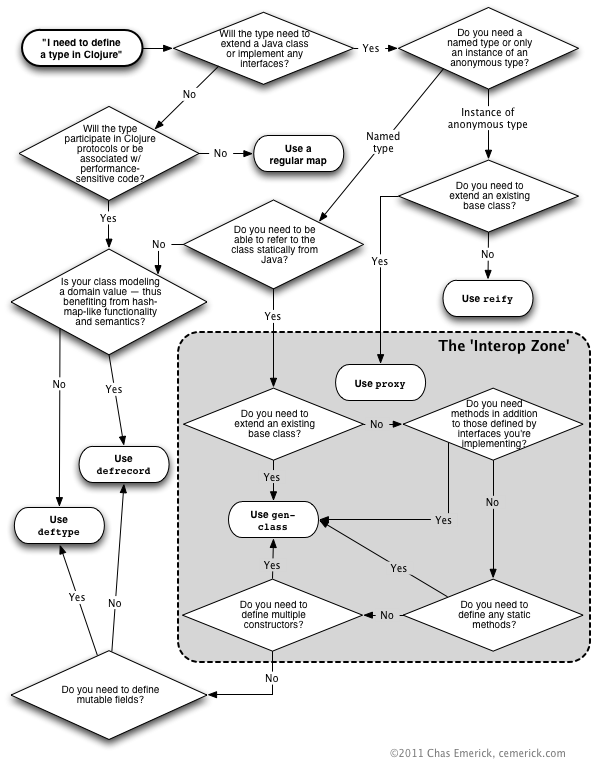

# Clojure Programming

version in books: 1.4.0.

skimming: 2026-01-23

# Setup

```shell
$ lein new app clojure-programming
```

# 1. Down the Rabbit Hole
- Why Clojure?
- Obtaining Clojure
- The Clojure REPL
- No, Parentheses Actually Won’t Make You Go Blind
- Expressions, Operators, Syntax, and Precedence
- Homoiconicity/同像性
- The Reader: `read`, `read-string`, `pr`, `pr-str`
  - Scalar Literals/标量字面量
    - Strings
    - Booleans
    - `nil`
    - Characters
    - Keywords: `::`, `name`, `namespace`
    - Symbols
    - Numbers
    - Regular expressions
  - Comments/注释
  - Whitespace and Commas/空白和逗号
  - Collection Literals/集合字面量
  - Miscellaneous Reader Sugar/Reader语法糖
- Namespaces/命名空间
  - `*ns*`: current namespace
  - `ns` macro
- Symbol Evaluation/符号求值
- Special Forms/特殊形式
  - Suppressing Evaluation: `quote`, `'`
  - Code Blocks: `do`
  - Defining Vars: `def`
  - Local Bindings: `let`
  - Destructuring (`let`, Part 2)
    - Sequential destructuring
    - Map destructuring
  - Creating Functions: `fn`
  - Destructuring function arguments
  - Function literals
  - Conditionals: `if`
  - Looping: `loop` and `recur`
  - Referring to Vars: `var`
  - Java Interop: `.` and `new`
  - Exception Handling: `try` and `throw`
  - Specialized Mutation: `set!`
  - Primitive Locking: `monitor-enter` and `monitor-exit`
- Putting It All Together
  - `eval`
- This Is Just the Beginning

# I. Functional Programming and Concurrency/函数式编程和并发

## 2. Functional Programming/函数式编程
- What Does Functional Programming Mean?
- On the Importance of Values
  - About Values
  - Comparing Values to Mutable Objects
  - A Critical Choice
- First-Class and Higher-Order Functions: `map`, `reduce`, `comp`, `complement`, `repeatedly`, ...
  - Applying Ourselves Partially: `apply`, `partial`
- Composition of Function(ality): `comp`, `->`, `->>`
  - Writing Higher-Order Functions
  - Building a Primitive Logging System with Composable Higher-Order Functions
- Pure Functions
  - Why Are Pure Functions Interesting?: `memoize`
- Functional Programming in the Real World

## 3. Collections and Data Structures/集合和数据结构
- Abstractions over Implementations
  - Collection/集合: `IPersistentCollection`, `ITransientCollection`
  - Sequences/序列: `Sequential`, `ISeq`
    - Sequences are not iterators
    - Sequences are not lists
    - Creating seqs
    - Lazy seqs: `LazySeq`
    - Head retention
  - Associative/关联: `Associative`
    - Beware of `nil` values
  - Indexed/带索引的: `Indexed`
  - Stack/栈: `IPersistentStack`
  - Set/集: `IPersistentSet`, `ITransientSet`
  - Sorted/排序的: `Sorted`
    - Comparators and predicates to define ordering
- Concise Collection Access
  - Clojure collections are functions that lookup the value associated with the key or index
  - keywords and symbols are functions that lookup themselves in the collection
  - Idiomatic Usage
  - Collections and Keys and Higher-Order Functions
- Data Structure Types
  - Lists/列表
  - Vectors/向量
    - Vectors as tuples
  - Sets/集
  - Maps/映射
    - Maps as ad-hoc structs
    - Other usages of maps
- Immutability and Persistence
  - Persistence and Structural Sharing
    - Visualizing persistence: lists
    - Visualizing persistence: maps (and vectors and sets)
    - Tangible benefits
  - Transients
- Metadata
- Putting Clojure’s Collections to Work
  - Identifiers and Cycles
  - Thinking Different: From Imperative to Functional
    - Revisiting a classic: Conway’s Game of Life
    - Maze generation
  - Navigation, Update, and Zippers
    - Manipulating zippers
    - Custom zippers
    - Ariadne’s zipper

## 4. Concurrency and Parallelism/并发和并行
- Shifting Computation Through Time and Space
  - Delays: `delay`, `deref`/`@`
  - Futures: `future`, `deref`/`@`
  - Promises: `promise`, `deliver`, `deref`/`@`
- Parallelism on the Cheap
- State and Identity
- Clojure Reference Types: **vars**, **refs**, **agents**, **atoms**
  - metadata, watches, validator
- Classifying Concurrent Operations
  - coordination
  - synchronization
- Atoms: `atom`, `swap!`, `compare-and-set!`, `reset!`
- Notifications and Constraints
  - Watches: `add-watch`, `remove-watch`
  - Validators: `:validator`, `set-validator!`
- Refs: `ref`
  - Software Transactional Memory
  - The Mechanics of Ref Change: `dosync`
    - Understanding `alter`
    - Minimizing transaction conflict with `commute`
    - Clobbering ref state with `ref-set`
    - Enforcing local consistency by using validators
  - The Sharp Corners of Software Transactional Memory
    - Side-effecting functions strictly verboten
    - Minimize the scope of each transaction
    - Readers may retry
    - Write skew
- Vars: `(var a-var)`/`#'a-var`, `def`
  - Defining Vars
    - Private vars
    - Docstrings
    - Constants
  - Dynamic Scope
  - Vars Are Not Variables
  - Forward Declarations
- Agents: `agent`, `send`, `send-off`, `await`
  - Dealing with Errors in Agent Actions: `agent-error`, `restart-agent`(`:clear-actions`)
    - Agent error handlers and modes: `:error-mode`(`:fail`, `:continue`), `:error-handler`, `set-error-handler!`, `set-error-mode!`
  - I/O, Transactions, and Nested Sends
    - Persisting reference states with an agent-based write-behind log
    - Using agents to parallelize workloads
- Using Java’s Concurrency Primitives: `java.util.concurrent`
  - Locking: `locking`

# II. Building Abstractions/构建抽象

## 5. Macros
- What Is a Macro?
  - What Macros Are Not
  - What Can Macros Do that Functions Cannot?
  - Macros Versus Ruby eval
- Writing Your First Macro: `defmacro`, `macroexpand-1`
- Debugging Macros
  - Macroexpansion: `macroexpand-1`, `macroexpand`
- Syntax
  - `quote`/`'` Versus `syntax-quote`/``` ` ```
  - `unquote`/`~` and `unquote-splicing`/`~@`
- When to Use Macros
- Hygiene
  - Gensyms to the Rescue: `gensym`, `#` suffix auto-gensym
  - Letting the User Pick Names
  - Double Evaluation
- Common Macro Idioms and Patterns
- The Implicit Arguments: `&env` and `&form`
  - `&env`
  - `&form`
    - Producing useful macro error messages
    - Preserving user-provided type hints
  - Testing Contextual Macros
- In Detail: `->` and `->>`
  - `..`

## 6. Datatypes and Protocols
- Protocols
- Extending to Existing Types
- Defining Your Own Types
  - Records
    - Constructors and factory functions
    - When to use maps or records
  - Types

- Implementing Protocols
  - Inline Implementation
    - Inline implementations of Java interfaces
    - Defining anonymous types with reify
  - Reusing Implementations

- Protocol Introspection
- Protocol Dispatch Edge Cases
- Participating in Clojure’s Collection Abstractions

## 7. Multimethods
- Multimethods Basics
- Toward Hierarchies

- Hierarchies
  - Independent Hierarchies

- Making It Really Multiple!

- A Few More Things
  - Multiple Inheritance
  - Introspecting Multimethods
  - type Versus class; or, the Revenge of the Map
  - The Range of Dispatch Functions Is Unlimited

# III. Tools, Platform, and Projects/工具, 平台和项目

## 8. Organizing and Building Clojure Projects
- Project Geography
  - Defining and Using Namespaces
    - Namespaces and files
    - A classpath primer
  - Location, Location, Location
  - The Functional Organization of Clojure Codebases
    - Basic project organization principles

- Build
  - Ahead-of-Time Compilation
  - Dependency Management
  - The Maven Dependency Management Model
    - Artifacts and coordinates
    - Repositories
    - Dependencies
  - Build Tools and Configuration Patterns
    - Maven
    - Leiningen
    - AOT compilation configuration
    - Building mixed-source projects

## 9. Java and JVM Interoperability
- The JVM Is Clojure’s Foundation
- Using Java Classes, Methods, and Fields
- Handy Interop Utilities
- Exceptions and Error Handling
  - Escaping Checked Exceptions
  - with-open, finally’s Lament
- Type Hinting for Performance
- Arrays

- Defining Classes and Implementing Interfaces
  - Instances of Anonymous Classes: proxy
  - Defining Named Classes
    - gen-class
  - Annotations
    - Producing annotated JUnit tests
    - Implementing JAX-RS web service endpoints

- Using Clojure from Java
  - Using deftype and defrecord Classes
  - Implementing Protocol Interfaces
- Collaborating Partners

## 10. REPL-Oriented Programming
- Interactive Development
  - The Persistent, Evolving Environment
- Tooling
- The Bare REPL
  - Introspecting namespaces
- Eclipse
- Emacs
  - clojure-mode and paredit
  - inferior-lisp
  - SLIME

- Debugging, Monitoring, and Patching Production in the REPL
  - Special Considerations for “Deployed” REPLs
- Limitations to Redefining Constructs

# IV. Practicums/实习

## 11. Numerics and Mathematics
- Clojure Numerics
  - Clojure Prefers 64-bit (or Larger) Representations
  - Clojure Has a Mixed Numerics Model
  - Rationals
  - The Rules of Numeric Contagion

- Clojure Mathematics
  - Bounded Versus Arbitrary Precision
  - Unchecked Ops
  - Scale and Rounding Modes for Arbitrary-Precision Decimals Ops

- Equality and Equivalence
  - Object Identity (`identical?`)
  - Reference Equality (`=`)
  - Numeric Equivalence (`==`)
    - Equivalence can preserve your sanity

- Optimizing Numeric Performance
  - Declare Functions to Take and Return Primitives
    - Type errors and warnings
  - Use Primitive Arrays Judiciously
    - The mechanics of primitive arrays
    - Automating type hinting of multidimensional array operations

- Visualizing the Mandelbrot Set in Clojure

## 12. Design Patterns
- Dependency Injection
- Strategy Pattern
- Chain of Responsibility
- Aspect-Oriented Programming

## 13. Testing
- Immutable Values and Pure Functions
  - Mocking
- clojure.test
  - Defining Tests
  - Test “Suites”
  - Fixtures
- Growing an HTML DSL
- Relying upon Assertions
  - Preconditions and Postconditions

## 14. Using Relational Databases
- clojure.java.jdbc
  - with-query-results Explained
  - Transactions
  - Connection Pooling
- Korma
  - Prelude
  - Queries
  - Why Bother with a DSL?
- Hibernate
  - Setup
  - Persisting Data
  - Running Queries
  - Removing Boilerplate

## 15. Using Nonrelational Databases
- Getting Set Up with CouchDB and Clutch
- Basic CRUD Operations
- Views
  - A Simple (JavaScript) View
  - Views in Clojure
- _changes: Abusing CouchDB as a Message Queue
- À la Carte Message Queues

## 16. Clojure and the Web
- The “Clojure Stack”
- The Foundation: Ring
  - Requests and Responses
  - Adapters
  - Handlers
  - Middleware
- Routing Requests with Compojure
- Templating
  - Enlive: Selector-Based HTML Transformation
    - Testing the waters
    - Selectors
    - Iterating and branching
    - Putting everything together

## 17. Deploying Clojure Web Applications
- Java and Clojure Web Architecture
  - Web Application Packaging
    - Building .war files with Maven
    - Building .war files with Leiningen
- Running Web Apps Locally
- Web Application Deployment
  - Deploying Clojure Apps to Amazon’s Elastic Beanstalk
- Going Beyond Simple Web Application Deployment

# V. Miscellanea/杂项

## 18. Choosing Clojure Type Definition Forms Wisely



## 19. Introducing Clojure into Your Workplace
- Just the Facts…
- Emphasize Productivity
- Emphasize Community
- Be Prudent

## 20. What’s Next?
- (dissoc Clojure ‘JVM)
  - ClojureCLR
  - ClojureScript
- 4Clojure
- Overtone
- core.logic
- Pallet
- Avout
- Clojure on Heroku

# See Also
* [Maze Generation: Algorithm Recap](https://weblog.jamisbuck.org/2011/2/7/maze-generation-algorithm-recap) - Jamis Buck, 2011-02-07
